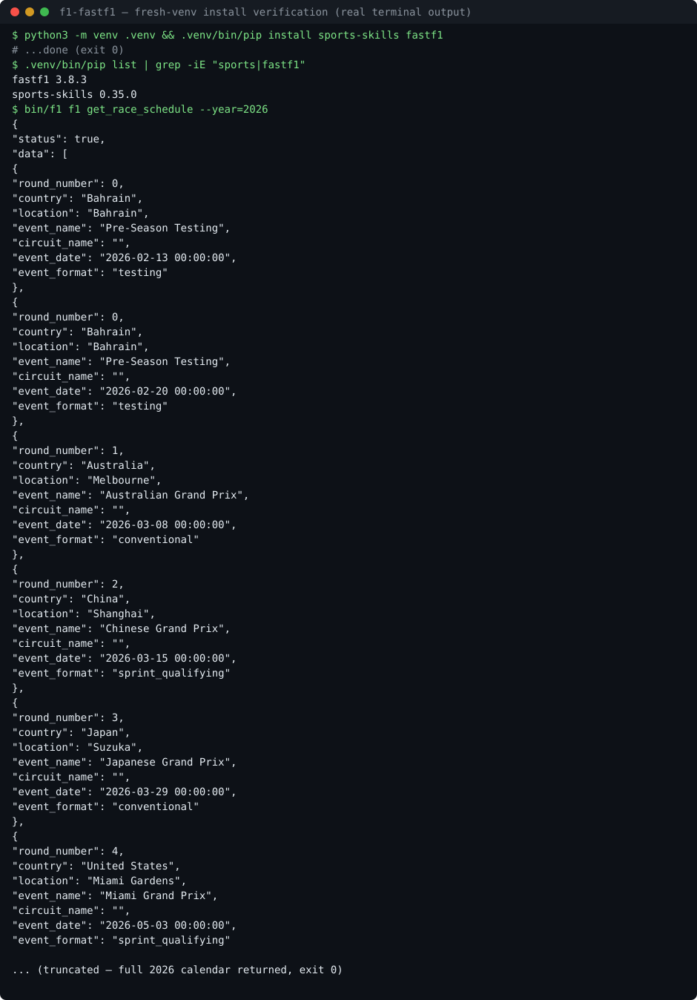

# f1-fastf1 — 安装说明 / Installation

> 2026-10-07 在全新 venv 中真实跑通验证（Python 3.12，sports-skills 0.35.0，fastf1 3.8.3）。
> Verified end-to-end on 2026-10-07 in a fresh venv (Python 3.12, sports-skills 0.35.0, fastf1 3.8.3).

## 为什么需要这一步 / Why this step

本仓库不含 `.venv/`（体积原因未上传）。`bin/f1` 会调用 `<skill>/.venv/bin/python`，
所以首次使用前需要自建一次虚拟环境，只需要做一次。
This repo does not ship `.venv/`. `bin/f1` calls `<skill>/.venv/bin/python`,
so you need to create the venv once before first use. One-time only.

## 步骤 / Steps

```bash
cd skills/f1-fastf1
python3 -m venv .venv
.venv/bin/pip install sports-skills fastf1
```

验证 / Verify:

```bash
bin/f1 f1 get_race_schedule --year=2026
```

应返回 `"status": true` 开头的 2026 赛历 JSON。
You should get the 2026 calendar as JSON starting with `"status": true`.



## 说明 / Notes

- 需要 Python 3.10+（实测 3.12）。Python 3.10+ required (tested on 3.12).
- `pip install sports-skills` 不会自动带上 `fastf1`，两个包都要装。
  `pip install sports-skills` alone does not pull in `fastf1`; install both.
- 首次查询某场比赛会下载数据（约 1–2 分钟），之后走 `.cache/fastf1/` 本地缓存。
  The first query for a session downloads data (~1–2 min); later calls use the local `.cache/fastf1/`.
- 不要把 `.venv/` 和 `.cache/` 提交进仓库。Do not commit `.venv/` or `.cache/`.
- 数据来自 FastF1（F1 官方 livetiming 历史），个人非商用。Data: FastF1 (official F1 livetiming history), personal non-commercial use.
